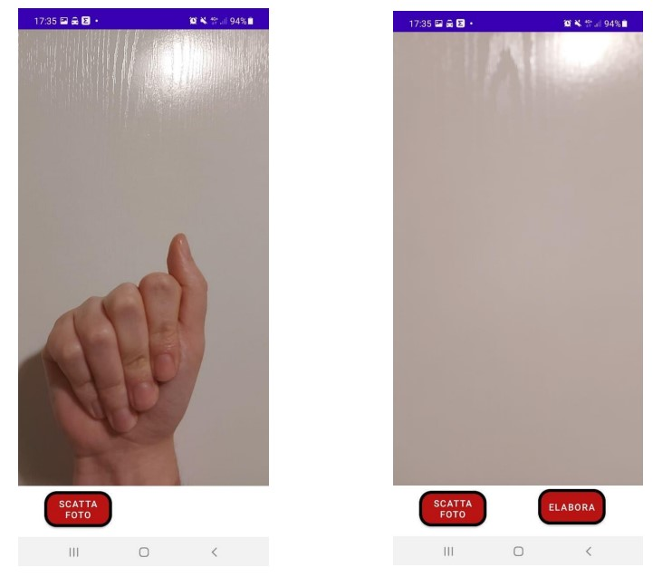
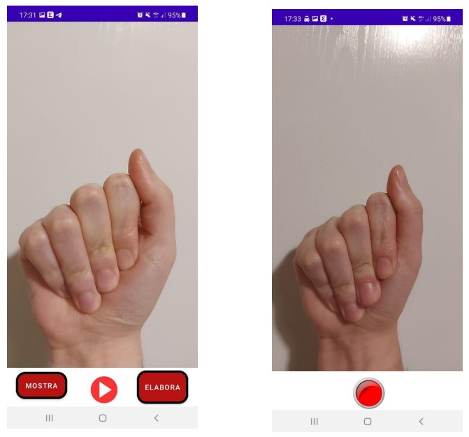
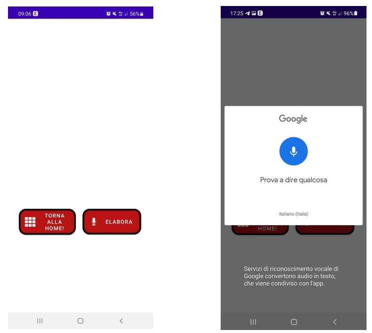
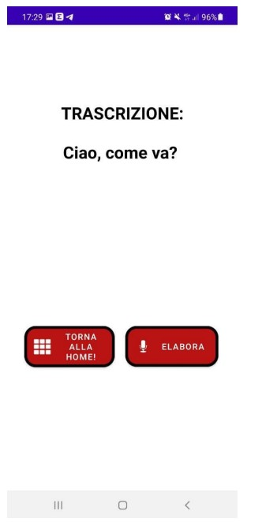

# GestureRec
Digital Systems project - Computer Engineering at Alma Mater Studiorum (University of Bologna)

## What is?
This is a university project created for the Digital Systems course held by Professor Matteo Poggi and Professor Stefano Mattoccia at the university of Bologna. :books:

## Abstract
The Gesture Rec application is an application for Android devices designed for
support for people with dumbness and/or deafness. It allows, in fact, to
recognize the various gestures of sign language using the camera of the
device and to transcribe what is said.
The application is mainly composed of three features:
1. Photo mode: the user, through the camera, frames the gesture and takes a picture that will be processed and the meaning of the
gesture will be shown.
2. Video mode: the user, through the camera, records a video in which
various gestures are performed. The video will be processed and will be displayed on the screen
shown the meaning attributed to the word or phrase previously
registered.
3. Audio mode: the user records an audio and what has been said is reported on
screen (feature designed to allow a user to speak in
quickly to a person with deafness).

## Screenshots of the app
Home view:

  

Photo and elaboration views:

  

  

Video and elaboration views:

  

  

Audio elaboration views:

  

  

## Neural network
Neural network model:

  

## Credits 🫂
- [Luca Berardi](https://github.com/LucaBerardi6)
- [Marco Motamed](https://github.com/MotaMarco)
- [Giuseppe Sergi](https://github.com/GiuseppeSergi3) 

