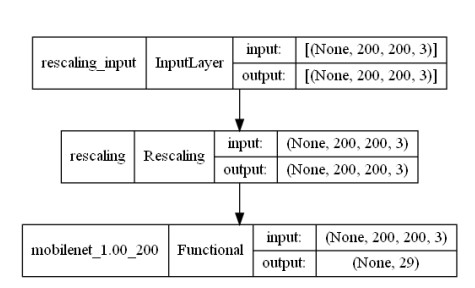
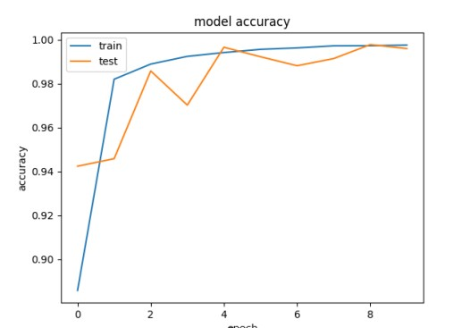
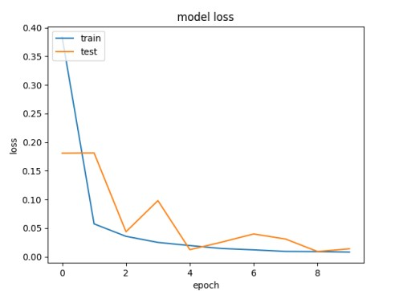
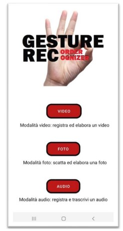
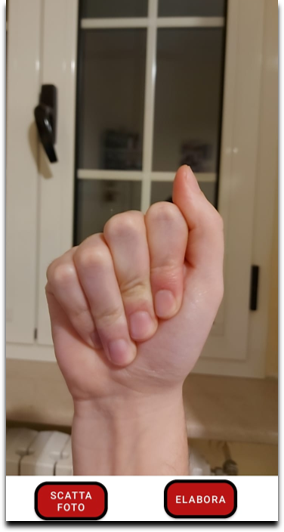
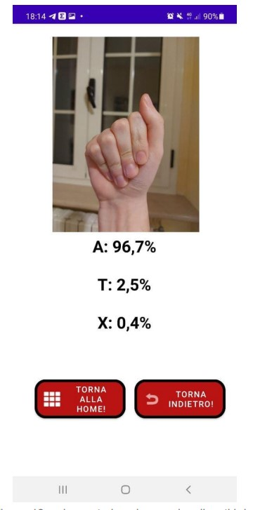
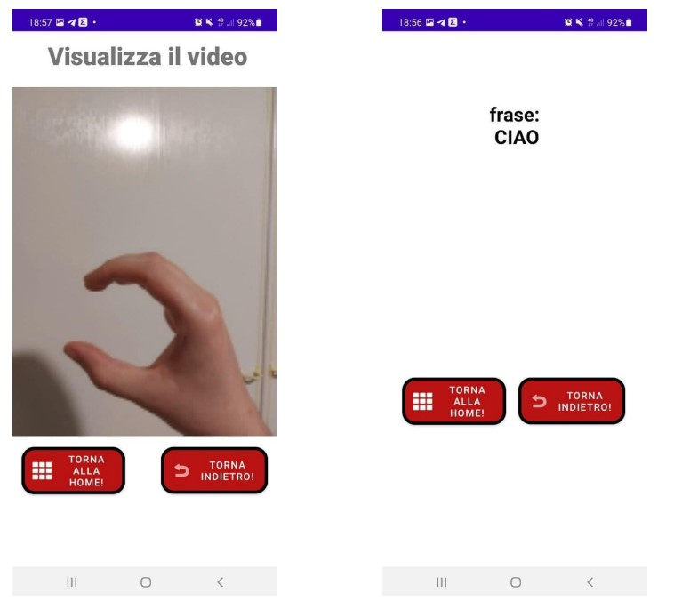

# GestureRec
Digital Systems project - Computer Engineering at Alma Mater Studiorum (University of Bologna)

## What about?
This is a university project created for the Digital Systems course held by Professor Matteo Poggi and Professor Stefano Mattoccia at the university of Bologna. :books:

## Abstract
The [Gesture Rec application](https://github.com/UniIdeas/GestureRec/tree/main/data/Android_app/Es_Sistemi_Digitali) is an application for Android devices designed for
support for people with dumbness and/or deafness. It allows, in fact, to
recognize the various gestures of sign language using the camera of the
device and to transcribe what is said.
The application is mainly composed of three features:
1. Photo mode: the user, through the camera, frames the gesture and takes a picture that will be processed and the meaning of the
gesture will be shown.
2. Video mode: the user, through the camera, records a video in which
various gestures are performed. The video will be processed and will be displayed on the screen
shown the meaning attributed to the word or phrase previously
registered.
3. Audio mode: the user records an audio and what has been said is reported on
screen (feature designed to allow a user to speak in
quickly to a person with deafness).

## [Neural network](https://github.com/UniIdeas/GestureRec/tree/main/data/NeuralNetwork)
TensorFlow 2.7.0 with Keras was used for the development of the network.
The MobileNet model was used for its predisposition to mobile devices thanks to its lightness and limited use of resources.
For the training of the network a dataset was used consisting of about 7760 images for each of the 29 classes (the letters of the alphabet and some standard gestures), for a total of 225040 images.

Dataset: 80% training set, 20% validation set.

The model [NeuralNetwork.h5](https://github.com/UniIdeas/GestureRec/blob/main/data/NeuralNetwork/NeuralNetwork.h5) was made with the following code: [NeuralNetwork.py](https://github.com/UniIdeas/GestureRec/blob/main/data/NeuralNetwork/NeuralNetwork.py).  
The [testNeuralNetwork.p](https://github.com/UniIdeas/GestureRec/blob/main/data/NeuralNetwork/testNeuralNetwork.py) file was used to test the model. 
The training was carried out for 10 epochs with a final accuracy of 99.76%.
It was later converted to a [tflite model](https://github.com/UniIdeas/GestureRec/blob/main/data/NeuralNetwork/model.tflite) via the [toTFlite.py](https://github.com/UniIdeas/GestureRec/blob/main/data/NeuralNetwork/toTFlite.py) file for use on mobile [app](https://github.com/UniIdeas/GestureRec/tree/main/data/Android_app/Es_Sistemi_Digitali).

Neural network model:

  

## Model Results

   &nbsp &nbsp&nbsp &nbsp &nbsp&nbsp &nbsp &nbsp&nbsp
  

## Screenshots of the app
Some screenshots from the app (to see other screenshots go to the dir [Images](https://github.com/UniIdeas/GestureRec/tree/main/Images)):

   
  &nbsp &nbsp&nbsp &nbsp &nbsp&nbsp &nbsp &nbsp&nbsp   &nbsp &nbsp&nbsp &nbsp &nbsp&nbsp &nbsp &nbsp&nbsp
  

        
  

  
    &nbsp &nbsp&nbsp &nbsp &nbsp&nbsp &nbsp &nbsp&nbsp   &nbsp &nbsp&nbsp &nbsp &nbsp&nbsp &nbsp &nbsp&nbsp
  
 
  

  

## Credits 🫂
- [Luca Berardi](https://github.com/LucaBerardi6)
- [Marco Motamed](https://github.com/MotaMarco)
- [Giuseppe Sergi](https://github.com/GiuseppeSergi3) 

## Bibliograpy
- [Examples](https://github.com/tensorflow/examples)
- [QuickStart](https://www.tensorflow.org/lite/android/quickstart)
- [Tensorflow](https://www.tensorflow.org/)
- [Keras](https://keras.io/api/applications/)

